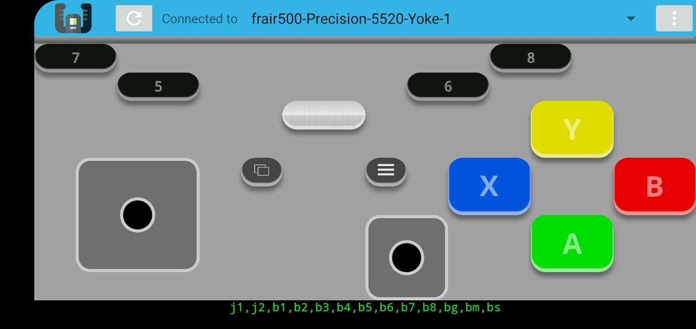

# Yoke Xbox Controller (desktop client)



> Xbox controller for your android mobile phone.

This project is built on top of the awesome [yoke](https://github.com/rmst/yoke),
but just provides one joystick: a Xbox Controller, and all the tools needed for
using it with [Steam](https://store.steampowered.com/).

Android APK: [download](./devel/app-debug.apk)

If you don't trust the apk you can try downloading the official releases,
but they may not be up-to-date, [this issue](https://github.com/rmst/yoke-android/pull/9) was present on android > 9.
You can also build the apk yourself from the [yoke-android](https://github.com/rmst/yoke-android) repo.

Get the Android app on [F-Droid](https://f-droid.org/packages/com.simonramstedt.yoke/), [Google Play](https://play.google.com/store/apps/details?id=com.simonramstedt.yoke) or [Github](https://github.com/rmst/yoke-android).
You should have the latest WebKit in your android device.

## Linux

```bash
# Requires Python 3.5+ which comes pre-installed in Ubuntu 16.04 and after.
git clone https://github.com/Woile/yoke-xbox-controller
cd yoke
# Now tweak files in e.g. yoke/assets/joypad
python3 -m venv venv
. venv/bin/activate
python -m pip install -e .
```

Let yoke create gamepad devices by adding a `udev` rule

```bash
./bin/yoke-enable-uinput
```

(This can be undone via `./bin/yoke-disable-uinput`)

And then you have to export this variable to your env for Steam:

```bash
export SDL_GAMECONTROLLERCONFIG="06000000596f6b650000000000000000,xbox-controller,platform:Linux,a:b0,b:b1,x:b3,y:b2,back:b8,guide:b10,start:b9,leftshoulder:b4,rightshoulder:b5,leftx:a0,lefty:a1,rightx:a2,righty:a3,lefttrigger:b6,righttrigger:b7,"
```

IF you want you can add the rule to your `.bashrc` to avoid adding the env
every time you restart your machine.

```bash
echo -e "\n# Setting for yoke xbox controller\nexport SDL_GAMECONTROLLERCONFIG="06000000596f6b650000000000000000,xbox-controller,platform:Linux,a:b0,b:b1,x:b3,y:b2,back:b8,guide:b10,start:b9,leftshoulder:b4,rightshoulder:b5,leftx:a0,lefty:a1,rightx:a2,righty:a3,lefttrigger:b6,righttrigger:b7,"" >> ~/.bashrc
```

And activate it

```bash
su $(whoami)
```

Run a yoke server

```bash
yoke
```

## Windows

I haven't tested it on windows.
Yoke needs the vJoy driver. The installer can be downloaded [here](https://sourceforge.net/projects/vjoystick/).

Now you can run the client with

```bash
yoke
```

Your computer should then show up in the Yoke app immediately if you are on the same network.

To test Yoke on Linux you can install, e.g. `jstest-gtk`:

```bash
sudo apt install jstest-gtk
jstest-gtk  # to run
```

To use Yoke effectively with SDL-based games (e.g. all games using Unreal Engine or Unity3D), you can install the SDL gamepad tool. (If the package is not found, [download the tool from the website](http://generalarcade.com/gamepadtool/).)

```bash
sudo apt install gamepadtool
gamepadtool   # to run
```

## Multiple virtual devices on the same machine

Each `yoke` process creates one virtual device.

```bash
./bin/yoke --port 3233 --name caro-device
```

## Security

The communication between the Linux client and the Android app are unencrypted UDP messages. You should therefore use it in networks you trust. However, if you are not in a trusted environment you can always create one via USB or Bluetooth. Just enable USB or Bluetooth tethering on your Android device and connect your Linux computer. This will create a mini-network for just your Phone and Computer and Yoke will work as usual.
